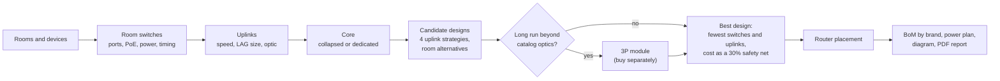

# AV Network BoM Builder: how it works

*Proof of concept: design logic, bandwidth and PoE calculations*

The BoM builder turns a list of AV devices per room into a NETGEAR switch design: switches, uplinks, core, power supplies, optics, a bill of materials, a network diagram and a power plan. It is a budgetary estimate; **advised sending the design to the ProAV Design team for further validation**.

For the full decision logic with flowcharts, see [How the BoM builder reaches its design](docs/design-logic.md), and [Decision making](docs/design-logic.md#decision-making-from-all-possible-designs-to-the-one-shown) for how the final design is picked.



## What the user enters

- **Rooms:** one main equipment room (MDF, holds the core) and any number of closets (IDF), each with fiber distance and type (multimode or single mode), and connectors: Default or Neutrik etherCON (M4350-16M4V) for live and touring racks, with an optional opticalCON QUAD uplink card.
- **Devices per room:** for example 1G/10G AV-over-IP encoders and decoders, Dante audio, PTZ cameras, touch panels and NETGEAR WiFi 7 access points. WiFi 7 APs have a **Connection** setting (for example a WBE758 on 2.5G and PoE+), with warnings when radios or backhaul are reduced.
- **Options:** region (SKUs), mains voltage, TAA, redundant power (all switches or main room only), redundant core, switch series (best fit, M4250 or M4350), gateway, and a support contract: Sprint, Overdrive or Fastlane for 1, 3 or 5 years, offered only where the product lists that tier. Managed switches already include 3 years of Sprint.
- **Design options:** line-rate or stream bandwidth, oversubscription, spare ports (10%), PoE headroom (20%), core-to-core link sizing.
- **Saving:** "Save project" writes a `.ntgrbom` file that only the BoM builder opens ("Open saved project"). It is compressed and masked, not encrypted, and the tool refuses a file that was edited outside it. Older `.json` project files still open.

## How switches are chosen

- **Each device needs the right port:** matching speed (1G, 2.5G, 10G, 25G), copper or fiber, and PoE type. A faster port can take a slower device; a 10G copper device without PoE can use an SFP+ port with a 10GBASE-T module (AXM765), but only as a fallback: switches with native copper ports are preferred. Spare ports (10%) are added to the port count, not to the PoE ports.
- **Every eligible switch is tested at 1, 2, 3... units** until it passes all checks: ports, PoE ports and class, PoE budget, and enough fiber ports left for uplinks. Eligible means active, in the chosen series, and TAA-compliant when TAA is on.
- **The best fit wins:** the lowest cost when list prices are in the catalog; otherwise the smallest design that passes, with penalties for extra PSU modules and optics not yet in the catalog. Close alternatives are shown as "Also fits".
- **Mixed rooms are split** when one model cannot serve every device, for example M4250 for 1G devices and M4350 for 10G PoE++ access points.
- **Devices are spread evenly** across a room's switches, and each switch shows its own devices and bandwidth.

## Bandwidth and uplinks

- **Line-rate (default):** every device counts at its full link speed, so the design is non-blocking. Stream mode uses each device's typical stream bandwidth instead.
- **Uplink groups use 1, 2, 4 or 8 links,** so link aggregation (LAG) hashing spreads traffic evenly. On stream bandwidth, uplinks keep a 50% margin over the stream total (`Stream_Uplink_Headroom_Pct`).
- **Collapsed core:** a single main-room switch with enough free ports is also the core, so small designs need no extra core switch.
- **Best design first:** among all valid designs, the one with the fewest switches and uplinks wins; cost is only a safety net (30%). Long runs that no catalog optic covers get a third-party module (for example 25GBASE-eSR) in the BoM instead of extra switches, with a warning. Every BoM line shows its brand (NETGEAR, optic.ca, Third party).
- **Parts must fit both ends:** optics and cables are checked against the Compatibility sheet for the room switch and the core, so an M4500-only optic never lands on an M4350. The PR460X gateway takes no DAC, so it gets 10G SR optics.
- **Timing needs per device type:** `PTP-BC` (boundary clock, e.g. ST 2110) and `AVB` (Milan) limit which switches and cores are used. Devices without a timing need still go on the cheapest switch, for example M4250 for Dante.
- **Router (PR460X):** on a free 10G port of the core when there is one. Otherwise it stays in the main room at the best speed available (10G, else 2.5G/1G copper or a 1G module, with a note), and only goes to a closet when the main room has no free port. The "Router link" option "10G required" makes the main-room switch keep a 10G port free for it, which can mean a bigger switch.
- **Redundant core:** each switch has a full-capacity link group to each core switch, so either core can carry all traffic if the other fails. No stacking is used, which keeps AVB and PTP available.

```
Example: 16 × 1G encoders + 8 × Dante devices on one switch
  Switch total at line-rate   16 + 8 = 24 Gbps
  Uplink needed per core      24 Gbps / 10G = 2.4, rounded up to 4 × 10G
  Redundant core              4 × 10G to Core A + 4 × 10G to Core B = 8 SFP+ ports
```

- **Core-to-core link** is sized from total traffic: busiest switch (failover), half of all traffic (default) or all traffic. Example: four closets of 40 Gbps each need 100 Gbps between cores, so 4 × 25G.

## Pro AV Design mode

Open the page with `?mode=proav` for the NETGEAR Pro AV Design team. Exports (PDF, diagram, CSV, Excel, design summary) become a **design proposal** without a "not validated" marking, and team-mode controls are shown. Add `&by=` and `&email=` to name the preparer, for example `index.html?mode=proav&by=Michael%20Dijk&email=mdijk@netgear.com`: the proposal then says who prepared it and sends pricing questions to that person. The mode never marks a design as validated; that stays with the admin flow. It is a simple switch, not access control: anyone with the URL can use it.

## Validation and catalog tools

- [Validation runs](docs/examples/validation/README.md): 30 test designs with the result, verdict and PDF report for each. Rerun with `node tools/validation/run.js` after any catalog or engine change.
- The Excel catalog is the source: `node tools/catalog_from_xlsx.js` rebuilds `data/catalog.json` from it, and `node tools/build.js` rebuilds `index.html`. See [Editing the catalog](docs/design-logic.md#editing-the-catalog).
