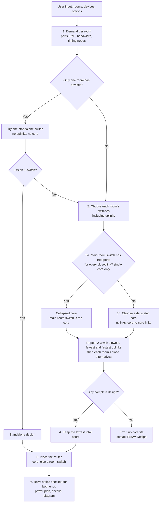
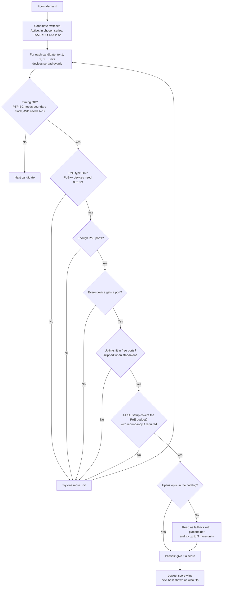
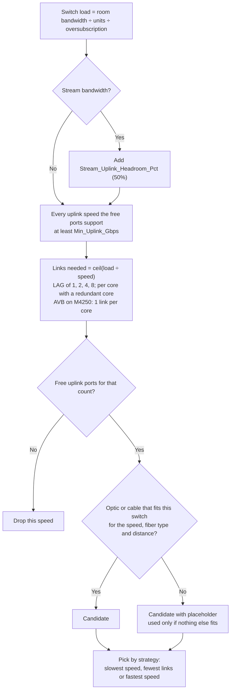
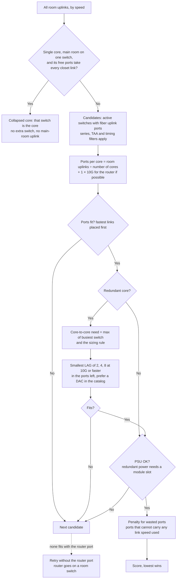
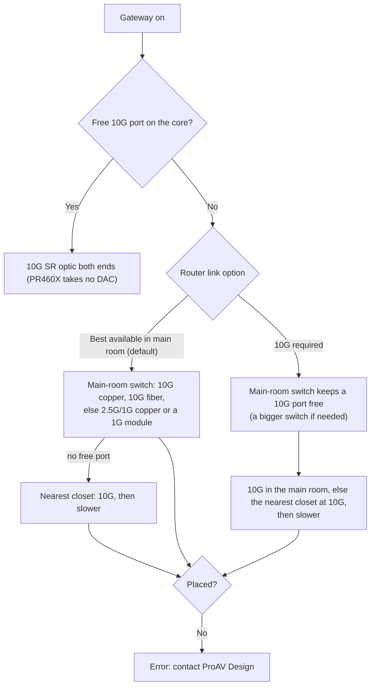

# How the BoM builder reaches its design

This page describes, step by step, how the engine (`src/engine.js`) turns rooms and devices into switches, uplinks, a core, power supplies and a bill of materials. Every rule below matches the current code. The result is a budgetary estimate; send the design to the ProAV Design team (proavdesign@netgear.com) for validation.

## Overview



## 1. Demand per room

For each room the engine adds up what the listed devices need. Every device type in the library has a link speed, media (copper or fiber), PoE watts and typical stream bandwidth.

| Item | How it is counted |
|---|---|
| Ports | Devices are grouped by speed, media and PoE. Each group gets **spare ports** on top: `ceil(qty × (1 + spare%))`. Default spare is 10%, so 8 devices need 9 ports. |
| PoE ports | The number of PoE devices as listed, **without** spare. Devices above 30 W need 802.3bt (PoE++) ports; 30 W and below need 802.3at/af. |
| PoE budget | Sum of device PoE watts, plus **PoE headroom** (default 20%). Example: 8 touch panels × 25 W = 200 W, needs 240 W. |
| Bandwidth | **Line-rate** (default): each device counts at its full link speed. **Stream**: each device counts at its typical stream bandwidth. |

## 2. Choosing switches for a room



### Port check

- Device groups are placed fastest first, PoE before non-PoE.
- Each group goes on the slowest port type that supports its speed and media. For example, 1G copper uses 1G RJ45 before 2.5G or 10G RJ45.
- **Copper modules are a fallback.** A 1G or 10G copper device without PoE can use a fiber cage with an RJ45 module (AGM734 / AXM765), but only once the native copper ports are used up. Each module adds a penalty to the score, so a switch with enough native copper ports wins.
- The M4250-16XF only takes 1G SFP modules in ports 1 to 12; the engine respects that limit.

### Uplink check (switches that connect to a core)



- LAG sizes are powers of two so link aggregation hashing spreads traffic evenly. Sizes come from `Tool_Settings` (`Uplink_LAG_Sizes`, `Max_LAG_Members`).
- Uplinks are never slower than `Min_Uplink_Gbps` (default 1). Raise it to 10 to force 10G uplinks everywhere.
- On **stream bandwidth**, uplinks must carry the room's stream total plus `Stream_Uplink_Headroom_Pct` (default 50%), because stream rates are typical, not peak. Line-rate is already worst case and gets no margin. Example: 7 Dante devices stream about 0.14 Gbps, plus 50% is 0.21 Gbps, so a 1G uplink fits and a 1G switch (M4250-9G1F) is chosen.
- Speeds with a catalog optic always come before speeds that would need a placeholder. If every speed needs a placeholder (for example 25G at 150 m multimode, where 25G SR reaches 100 m), the engine also tries one to three more switches at a lower speed. A placeholder costs more than an extra switch, so an orderable design wins.
- With a redundant core, each link group must carry the switch's full load on its own, so either core can fail.

### Power supply check

The engine reads the `PSU_PoE_Matrix` rows for that switch that match the mains voltage.

| Situation | Rule |
|---|---|
| No matrix rows (fixed internal PSU) | Allowed only when redundant power is off and the PoE need fits the base budget. |
| Redundant power off | Any configuration whose PoE budget covers the need. |
| Redundant power on | Only configurations with at least one extra PSU module. PoE must fit the **protected** budget, which is what remains after one supply fails. |
| Several configurations pass | The cheapest wins (fewest and smallest modules). |

Redundant power applies to **all switches**, or to the **main equipment room only** (main room switches and the core). It always applies to the core when it is on, with one or two cores.

### Timing requirements (PTP and AVB)

Each device type can carry a `Timing` value in the Endpoints sheet:

| Timing | Rule |
|---|---|
| blank | Any switch. Every model supports PTPv2 transparent clock, which is enough for Dante. |
| `PTP-BC` | The device's switch and the core must have a PTP boundary clock (M4350-8M2V, 24M4X4V, 24F4X, 16V4C, 40X4C, 40F4C). Used for ST 2110 (SMPTE 2059-2). |
| `AVB` | The switch must support AVB. M4250 does not run AVB over a LAG, so an M4250 with AVB devices gets one uplink per core. A room that needs more than one link moves to M4350 or more M4250 units. |

Devices without a timing need still go to the cheapest switch: in a mixed room, a split puts them on M4250 while the timing devices get an M4350.

### Scoring: "best fit"

- **With list prices in the catalog:** the score is the price, plus the cost of PSU modules.
- **Without list prices** (current catalog), the score per unit is:

  `10 + 0.35 × ports + fabric Gbps ÷ 150 + max PoE W ÷ 150 + 6 (if M4350) + PSU module cost`

  plus 4 per copper RJ45 module, 0.4 + speed ÷ 40 per uplink (two optics and a fiber pair), and 40 if an uplink optic is not in the catalog. The total is multiplied by the number of units.

This favors the smallest switch that passes all checks, and M4250 over M4350 when both fit.

### Mixed rooms

The engine also tries splitting a room into pools: **1G/2.5G copper**, **multi-gig copper** and **fiber** devices, and combinations of these. Each pool gets its own best switch. The whole-room option and every split are scored, and the lowest total wins. For example, an M4250 for 1G encoders and an M4350 for 10G PoE++ access points.

### Standalone

If only one room has devices, the engine first tries that room **without uplinks**. If it fits on a single switch, the design is standalone: no uplinks, no core. Otherwise it sizes the room with uplinks and adds a core.

## 3. Sizing the core



**Wasted ports.** A core is scored like a room switch, plus 0.5 for every port that cannot carry any link speed the design uses. Example: when every uplink is 10G, the 24 × 1/2.5G SFP ports of the M4350-24F4X are wasted, so the M4350-24F4V (24 × 10G SFP+) wins. When the uplinks run at 1G, for example an audio-only design on stream bandwidth, those ports are usable and the 24F4X can be chosen. A core may be filled completely; there is no spare-port rule for the core.

Core-to-core link sizing (Design options):

| Rule | Bandwidth needed |
|---|---|
| Busiest switch (failover) | Load of the busiest single room switch |
| Half of all traffic (default) | Half of all room traffic, never below the busiest switch |
| All traffic | All room traffic |

Example: four closets of 40 Gbps each, half rule = 80 Gbps, which becomes 4 × 25G = 100 Gbps.

### Collapsed core

When the main room has devices on a single switch, that switch can be the core: the other rooms' uplinks land on its free ports (after its own devices and spare ports), so no separate core switch is added. This applies with a single core (not with a redundant core), when no core model is forced, and when the switch meets the timing needs of the core (PTP boundary clock, AVB). If its free ports cannot take every closet link, a dedicated core is used as before. The diagram then shows the main room in the core position, with a "Core for" list.

Example: 7 Dante devices in the main room and 7 in a closet, stream bandwidth: two M4250-9G1F switches, the closet on a 1G SFP uplink (AGM731F), the router on a free 1G copper port. Before, this needed a third switch (M4250-16XF) as the core.

### Choosing the whole design

Room switches and the core are scored together, because a room's cheapest switch can force a bigger core.

1. The whole design is built three times, with room uplinks on the **slowest** speed that fits, the **fewest** links, and the **fastest** speed. The design with the lowest total score (rooms + core + uplinks) wins. A faster option must be clearly cheaper, so near-ties keep the slower uplinks.
2. For each room with one switch group, the engine then tries the room's next three "Also fits" switches on the whole design, and keeps any that lowers the total. Example: an M4350-36X4V on 4 × 25G scores lower for the room alone, but it needs an M4350-16V4C core. The M4350-24X8F8V on 8 × 10G lets the smaller M4350-24F4V terminate everything, so the whole design wins.
3. If no strategy finds a core, the engine shows an error suggesting 2:1 oversubscription, Best fit, or an aggregation layer.

## 4. Building the BoM

| Line | Rule |
|---|---|
| Switches | Orderable SKU for the region (or the TAA SKU when TAA is on). |
| PSU modules | From the chosen PSU configuration, with the power cord for the region. |
| Uplink optics | Links in the main room up to 20 m (`In_Rack_Max_m`) use a DAC or AOC cable, 1 per link. Longer links use an optic for the speed, fiber type and distance, shortest reach that covers it, 2 per link: one is booked in the room, the other in the core location, where each is installed. The diagram's core box lists every link it terminates (per room, part and speed) with a port-usage gauge. The part must be listed in the Compatibility sheet for **both** ends: the room switch and the core (see below). LRM and PSM4 (8-fiber MPO trunk) are used only when nothing else reaches. With equal reach, NETGEAR-branded parts come before optic.ca (`-OC`) parts. Missing items appear as `TBD` placeholders with a warning. Breakout cables are in the catalog but not used yet. |
| Fiber endpoints | One switch-side optic per fiber device. |
| Copper modules | One AGM734 / AXM765 per copper device on a fiber port, never for spare ports. |
| Core | Core switches, PSU modules, core-to-core DAC cables. |
| Gateway | PR460X router, on a free 10G port of the core. The PR460X does not take DAC/AOC cables, so that link is a 10G SR optic (AXM761) on both ends, plus a multimode LC patch cord (not in the BoM). If the core has no free 10G port (for example an M4500-32C, 100G only), the router goes on a room switch, main room first, then the nearest closet: a free 10G copper port over Cat6a when the run is within `Copper_10G_Max_m` (100 m), otherwise a free 10G fiber port with optics both ends fit. SFP28 ports next to 25G uplinks are skipped (one speed per 4-port block). If no 10G port is free anywhere, the router link drops to 1G with a warning in Checks: a free 1G/2.5G copper port first (no parts), otherwise a 1G SX module (AGM731F) on both ends in a free SFP port, with a note to confirm the PR460X SFP+ port accepts 1G modules. If no switch has a free port, the design shows a gateway error. |
| WiFi access points | NETGEAR APs in the device list are added as products. |
| Support | OnCall support SKU per switch, by support category and years. |

### Router placement



Slower links get a note: 2.5G is enough for most internet uplinks (the PR460X 2.5G WAN port runs up to 2.4 Gbps), and 1G gets a warning. With "10G required", a collapsed core only qualifies if it still has a free 10G port after every closet link. Otherwise the engine tries the main room's other switch choices on the whole design, or a dedicated core. Example (V31/V32): one Dante device plus two 10G closets uses an M4350-8M2V with the router on 2.5G copper, or with "10G required" an M4350-24G4XF with the router on 10G SFP+.

### Compatibility (which part fits which switch)

The Compatibility sheet lists, per family (for example M4350) or product (for example PR460X), the optics and cables it takes. When a family or product has rows there, only those parts are used for it; `Not compatible` rows are documentation only. A family without rows accepts any part.

| Link | Must fit |
|---|---|
| Room switch to core | Room switch and core |
| Core to core | Core |
| Fiber device | Its room switch |
| Gateway to core or room switch | PR460X and that switch |

Example: NETGEAR ACM761 (100G SR4) is listed for M4500 only, and the optic.ca NGQ100G-SR4-OC for M4350 and M4500. An M4350-40X4C closet on an M4500-32C core gets the optic.ca part; an M4500-48XF8C leaf on the same core gets the ACM761.

## 5. Power plan and checks

- **Estimated draw per switch** = datasheet maximum without PoE + PoE load ÷ PSU efficiency (0.9).
- **PoE headroom warning** when less than 10% of the budget is left.
- **Checks tab** lists placeholders, copper modules used, redundancy notes and the rules applied.

## Worked examples

| Input | Result | Why |
|---|---|---|
| 8 × 1G encoders (13 W) | M4250-10G2F-PoE+ | 9 ports with spare, 8 PoE ports, 125 W needed, budget 125 W. |
| 8 × touch panels (25 W) | M4250-10G2XF-PoE+ | Needs 240 W. The 10G2F has 125 W, so the next model up, with 240 W, is chosen. |
| 11 × 10G copper encoders, one room | 1 × M4350-12X12F, standalone | Native 10G copper ports; no core needed on one switch. |
| 8 × touch panels, redundant power on | M4350-24G4XF + APS600W | M4250 10-port models have one fixed PSU. The 8M2V has redundant PSUs but only 8 copper ports, and 9 are needed with spare. |
| Two closets + router, redundant core and power | 2 × M4350-24F4V core | Each core needs 5 × 10G (2 uplinks, 2 core-to-core, 1 router). The 24F4X has only 4. Fixed-PSU models (8X8F, 12X12F, 16XF) are excluded by redundant power. |
| Three closets + router, single core, 10G uplinks | M4350-24F4V core | The 24F4X has exactly the 4 × 10G ports needed, but its 24 × 1/2.5G ports are wasted at 10G, so it scores worse. |
| Audio-only closets, stream bandwidth, `Min_Uplink_Gbps` = 1 | M4350-24F4X core | Its 1/2.5G SFP ports carry the 1G uplinks, so none are wasted. With the default of 10, uplinks are 10G and the core is a 10G model. |
| Closets of 90G, 80G and 8G, single core | 4 × 25G, 8 × 10G, 1 × 10G; M4350-24F4V core | The 80G closet stays on 10G because 25G there would need a bigger core. |
| 90G closet at 150 m multimode | 2 switches, 8 × 10G each | 25G SR reaches 100 m, so splitting at 10G avoids a placeholder optic. |
| Six 60G closets, redundant core | 8 × 25G each; 2 × M4500-48XF8C core | 48 × 25G ports per core; no M4350 has that many. |
| Six rooms of 40 × 10G fiber, redundant core | M4500-48XF8C leaves, 8 × 100G (ACM761); 2 × M4500-32C | Spine and leaf as in the M4500 datasheet. |
| ST 2110 devices (`PTP-BC`) + 1G encoders | M4350-16V4C for the 2110 devices, M4250 for the encoders, BC-capable core | Only the timing devices need a boundary clock. |

## Editing the catalog

The Excel workbook is the source. After changing it:

```
python tools/fix_xlsx_cache.py            # only if the workbook was saved with openpyxl: restores formula results
npm i --no-save xlsx@0.18.5 && node tools/catalog_from_xlsx.js   # rebuild data/catalog.json
node tools/build.js                       # rebuild index.html
node tools/validation/run.js              # check the validation scenarios
```

`node tools/catalog_from_xlsx.js --check` reports whether the JSON still matches the workbook.

## Known limits

- No list prices in the catalog yet, so "best fit" means the smallest design that passes, not the cheapest. The scores for switches, cores and links are estimates; adding `List_Price_USD` to Products (and prices for optics) makes every comparison above a real cost comparison.
- QSFP28 breakout (4 × 25G / 4 × 10G) is not used yet. A core that must take many 100G links plus some 10G/25G links (for example 12 × 100G and one 10G closet) has no fit today; the engine shows an error.
- M4500 is not used for devices that need AVB or a PTP boundary clock (its datasheet lists neither), and its Sprint/Overdrive support SKUs are not added to the BoM yet.
- With a redundant core, one 10G port for the gateway is reserved on each core, but the BoM includes one gateway cable.
- No aggregation (spine/leaf) layer: very large networks must be designed by the ProAV Design team.
