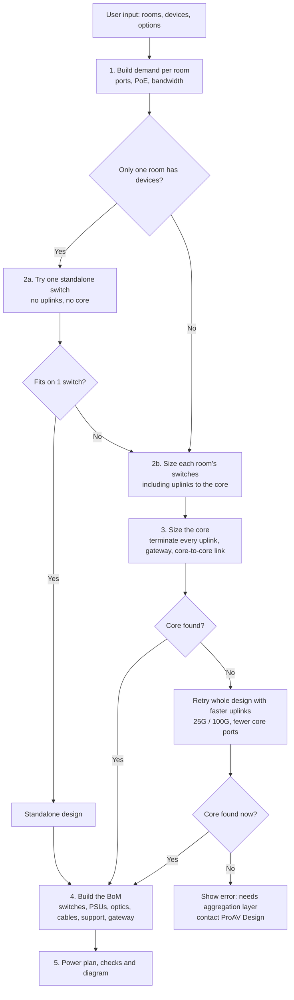
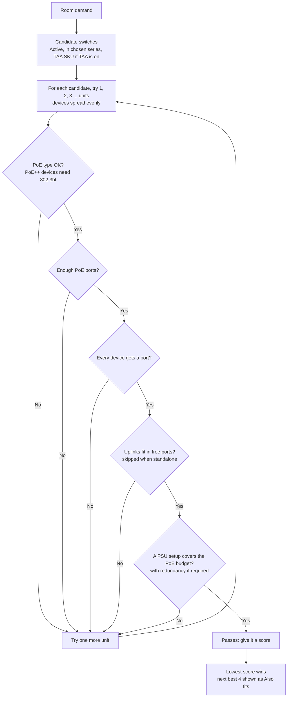
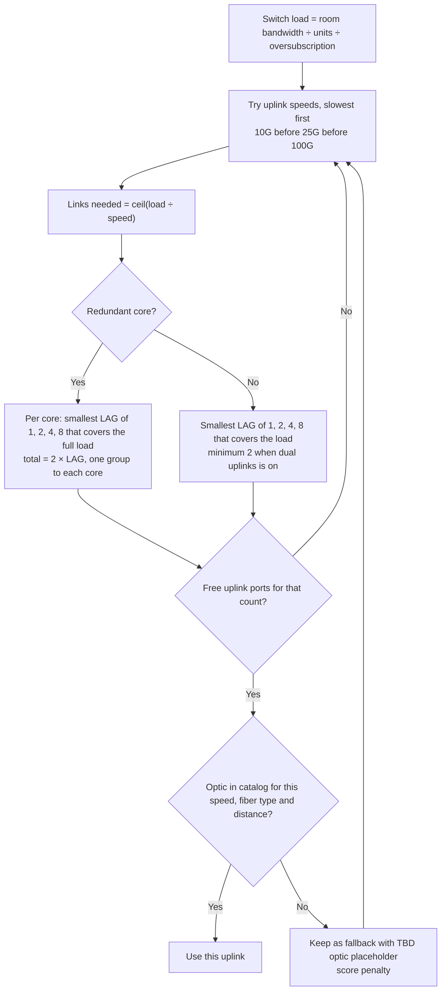
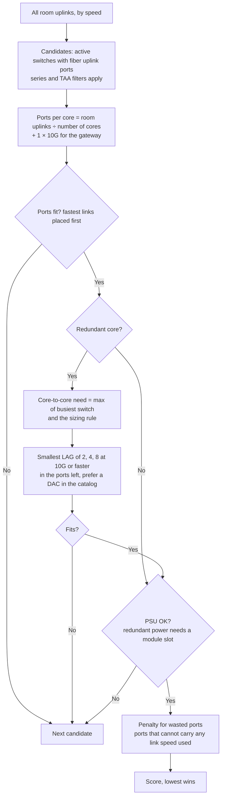

# How the BoM builder reaches its design

This page describes, step by step, how the engine (`src/engine.js`) turns rooms and devices into switches, uplinks, a core, power supplies and a bill of materials. Every rule below matches the current code. The result is a budgetary estimate; send the design to the ProAV Design team (proavdesign@netgear.com) for validation.

## Overview

## 1. Demand per room

For each room the engine adds up what the listed devices need. Every device type in the library has a link speed, media (copper or fiber), PoE watts and typical stream bandwidth.

| Item | How it is counted |
|---|---|
| Ports | Devices are grouped by speed, media and PoE. Each group gets **spare ports** on top: `ceil(qty × (1 + spare%))`. Default spare is 10%, so 8 devices need 9 ports. |
| PoE ports | The number of PoE devices as listed, **without** spare. Devices above 30 W need 802.3bt (PoE++) ports; 30 W and below need 802.3at/af. |
| PoE budget | Sum of device PoE watts, plus **PoE headroom** (default 20%). Example: 8 touch panels × 25 W = 200 W, needs 240 W. |
| Bandwidth | **Line-rate** (default): each device counts at its full link speed. **Stream**: each device counts at its typical stream bandwidth. |

## 2. Choosing switches for a room

### Port check

- Device groups are placed fastest first, PoE before non-PoE.
- Each group goes on the slowest port type that supports its speed and media. For example, 1G copper uses 1G RJ45 before 2.5G or 10G RJ45.
- **Copper modules are a fallback.** A 1G or 10G copper device without PoE can use a fiber cage with an RJ45 module (AGM734 / AXM765), but only once the native copper ports are used up. Each module adds a penalty to the score, so a switch with enough native copper ports wins.
- The M4250-16XF only takes 1G SFP modules in ports 1 to 12; the engine respects that limit.

### Uplink check (switches that connect to a core)

- LAG sizes are powers of two so link aggregation hashing spreads traffic evenly. Sizes come from `Tool_Settings` (`Uplink_LAG_Sizes`, `Max_LAG_Members`).
- With a redundant core, each link group must carry the switch's full load on its own, so either core can fail.

### Power supply check

The engine reads the `PSU_PoE_Matrix` rows for that switch that match the mains voltage.

| Situation | Rule |
|---|---|
| No matrix rows (fixed internal PSU) | Allowed only when redundant power is off and the PoE need fits the base budget. |
| Redundant power off | Any configuration whose PoE budget covers the need. |
| Redundant power on | Only configurations with at least one extra PSU module. PoE must fit the **protected** budget, which is what remains after one supply fails. |
| Several configurations pass | The cheapest wins (fewest and smallest modules). |

Redundant power applies to **all switches**, or to the **main equipment room only** (main room switches and the core). It always applies to the core when it is on, with one or two cores.

### Scoring: "best fit"

- **With list prices in the catalog:** the score is the price, plus the cost of PSU modules.
- **Without list prices** (current catalog), the score per unit is:

  `10 + 0.35 × ports + fabric Gbps ÷ 150 + max PoE W ÷ 150 + 6 (if M4350) + PSU module cost`

  plus 4 per copper RJ45 module, and 8 if an uplink optic is not in the catalog. The total is multiplied by the number of units.

This favors the smallest switch that passes all checks, and M4250 over M4350 when both fit.

### Mixed rooms

The engine also tries splitting a room into pools: **1G/2.5G copper**, **multi-gig copper** and **fiber** devices, and combinations of these. Each pool gets its own best switch. The whole-room option and every split are scored, and the lowest total wins. For example, an M4250 for 1G encoders and an M4350 for 10G PoE++ access points.

### Standalone

If only one room has devices, the engine first tries that room **without uplinks**. If it fits on a single switch, the design is standalone: no uplinks, no core. Otherwise it sizes the room with uplinks and adds a core.

## 3. Sizing the core

**Wasted ports.** A core is scored like a room switch, plus 0.5 for every port that cannot carry any link speed the design uses. Example: when every uplink is 10G, the 24 × 1/2.5G SFP ports of the M4350-24F4X are wasted, so the M4350-24F4V (24 × 10G SFP+) wins. When the uplinks run at 1G, for example an audio-only design on stream bandwidth, those ports are usable and the 24F4X can be chosen. A core may be filled completely; there is no spare-port rule for the core.

Core-to-core link sizing (Design options):

| Rule | Bandwidth needed |
|---|---|
| Busiest switch (failover) | Load of the busiest single room switch |
| Half of all traffic (default) | Half of all room traffic, never below the busiest switch |
| All traffic | All room traffic |

Example: four closets of 40 Gbps each, half rule = 80 Gbps, which becomes 4 × 25G = 100 Gbps.

If no core fits, the engine reruns the whole design with room uplinks on the **fastest** speeds first (25G, 100G). That uses fewer core ports. If that still fails, it shows an error suggesting 2:1 oversubscription, Best fit, or an aggregation layer.

## 4. Building the BoM

| Line | Rule |
|---|---|
| Switches | Orderable SKU for the region (or the TAA SKU when TAA is on). |
| PSU modules | From the chosen PSU configuration, with the power cord for the region. |
| Uplink optics | Links in the main room up to 20 m (`In_Rack_Max_m`) use a DAC or AOC cable, 1 per link. Longer links use an optic for the speed, fiber type and distance, shortest reach that covers it, 2 per link (both ends). Missing items appear as `TBD` placeholders with a warning. |
| Fiber endpoints | One switch-side optic per fiber device. |
| Copper modules | One AGM734 / AXM765 per copper device on a fiber port, never for spare ports. |
| Core | Core switches, PSU modules, core-to-core DAC cables. |
| Gateway | PR460X router and one DAC to the core. |
| WiFi access points | NETGEAR APs in the device list are added as products. |
| Support | OnCall support SKU per switch, by support category and years. |

## 5. Power plan and checks

- **Estimated draw per switch** = datasheet maximum without PoE + PoE load ÷ PSU efficiency (0.9).
- **PoE headroom warning** when less than 10% of the budget is left.
- **Checks tab** lists placeholders, copper modules used, redundancy notes and the rules applied.

## Worked examples

| Input | Result | Why |
|---|---|---|
| 8 × 1G encoders (13 W) | M4250-10G2F-PoE+ | 9 ports with spare, 8 PoE ports, 125 W needed, budget 125 W. |
| 8 × touch panels (25 W) | M4250-10G2XF-PoE+ | Needs 240 W. The 10G2F has 125 W, so the next model up, with 240 W, is chosen. |
| 11 × 10G copper encoders, one room | 1 × M4350-12X12F, standalone | Native 10G copper ports; no core needed on one switch. |
| 8 × touch panels, redundant power on | M4350-24G4XF + APS600W | M4250 10-port models have one fixed PSU. The 8M2V has redundant PSUs but only 8 copper ports, and 9 are needed with spare. |
| Two closets + router, redundant core and power | 2 × M4350-24F4V core | Each core needs 5 × 10G (2 uplinks, 2 core-to-core, 1 router). The 24F4X has only 4. Fixed-PSU models (8X8F, 12X12F, 16XF) are excluded by redundant power. |
| Three closets + router, single core, 10G uplinks | M4350-24F4V core | The 24F4X has exactly the 4 × 10G ports needed, but its 24 × 1/2.5G ports are wasted at 10G, so it scores worse. |
| Audio-only closets, stream bandwidth, 1G uplinks | M4350-24F4X core | Its 1/2.5G SFP ports carry the 1G uplinks, so none are wasted. |

## Known limits

- No list prices in the catalog yet, so "best fit" means the smallest design that passes, not the cheapest.
- With a redundant core, one 10G port for the gateway is reserved on each core, but the BoM includes one gateway cable.
- No aggregation (spine/leaf) layer: very large networks must be designed by the ProAV Design team.
